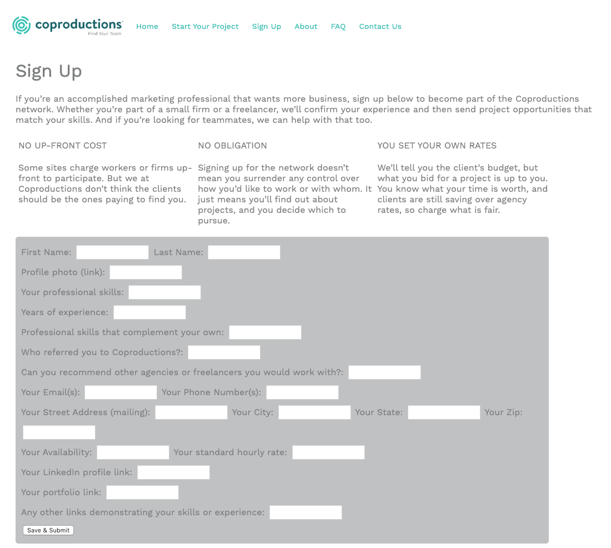

# Sign-Up & Member Profile Interface for Coproductions.com

A sign-up form, including edit and delete functions, for the worker database of Coproductions.com, a resource for marketing pros to find services

## Getting Started

All resources are available on github here: https://github.com/Junglefuss/project2

### Prerequisites

See package.json for dependencies

### Installing

If you're reading this, you probably know more about installing than I do! But if not, here's GA's guide for how to do it: https://git.generalassemb.ly/seir-826/w06d03-seir826-heroku-atlas-deployment

## Built With

- node.js/npm
- express
- Mongo DB

## Authors

- Jonathan Goldfuss, Software Engineering Immersive studient, General Assembly (826 cohort, 2019)

## License

This project is licensed under the MIT License - see the [LICENSE.md](LICENSE.md) file for details

## Acknowledgments

- Thanks to my instructors for bearing with my struggles.
